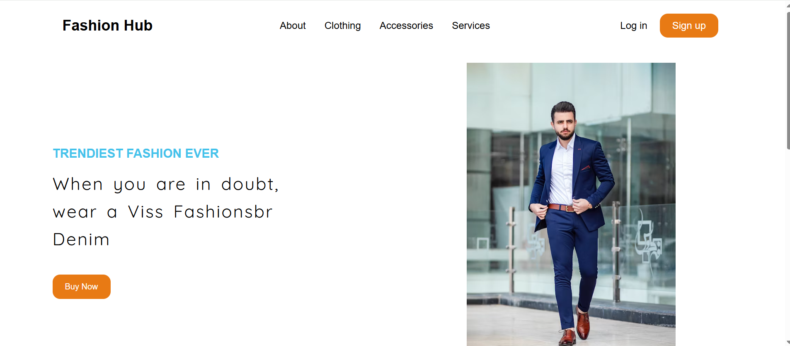
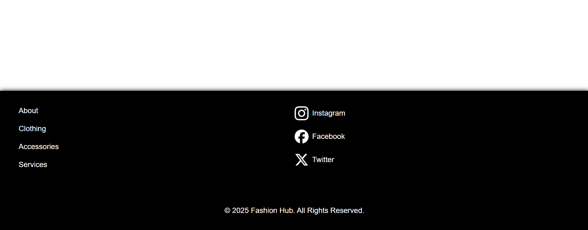
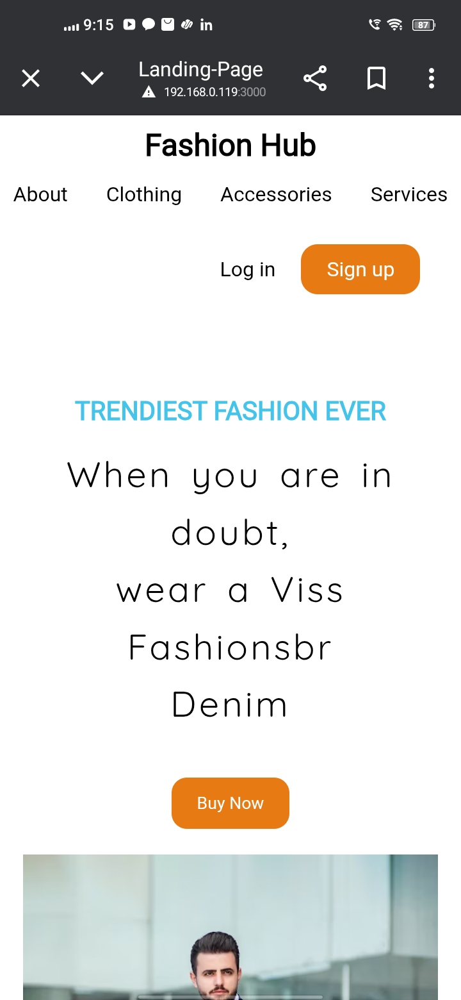
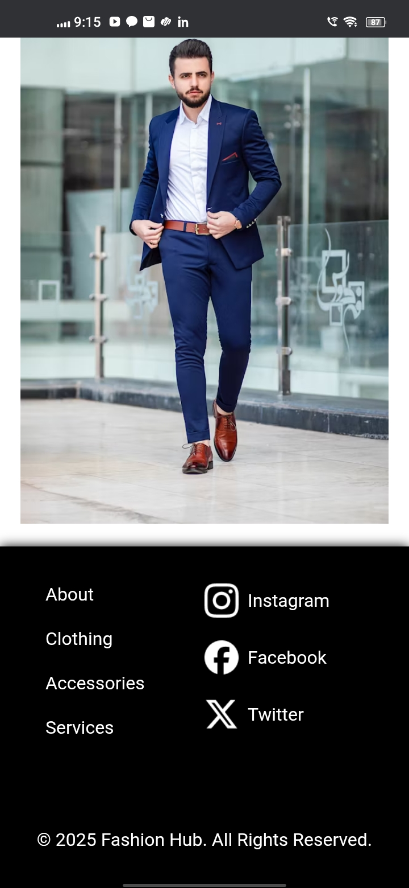

# 🚀 Fashion Hub – Responsive Landing Page

A simple and clean **responsive landing page** built using only **HTML** and **CSS** as part of my internship task.

---

## 📌 Objective

- Design and develop a responsive landing page
- Include: Header, Hero Section, Footer
- Make it mobile-friendly using media queries

---

## 🧱 Technologies Used

- HTML5  
- CSS3 (Flexbox, Grid, Media Queries)  
- Google Fonts  
- VS Code  
- Git & GitHub

---

## ✨ Features

- ✅ Branding with nav links
- ✅ Hero section with heading, description, CTA button, and image
- ✅ Footer with navigation and social media icons
- ✅ Fully responsive design for mobile and tablet

---

## 📸 Screenshots

> (Add your screenshots in a `screenshots/` folder and link them here)

---

## 📂 Folder Structure

